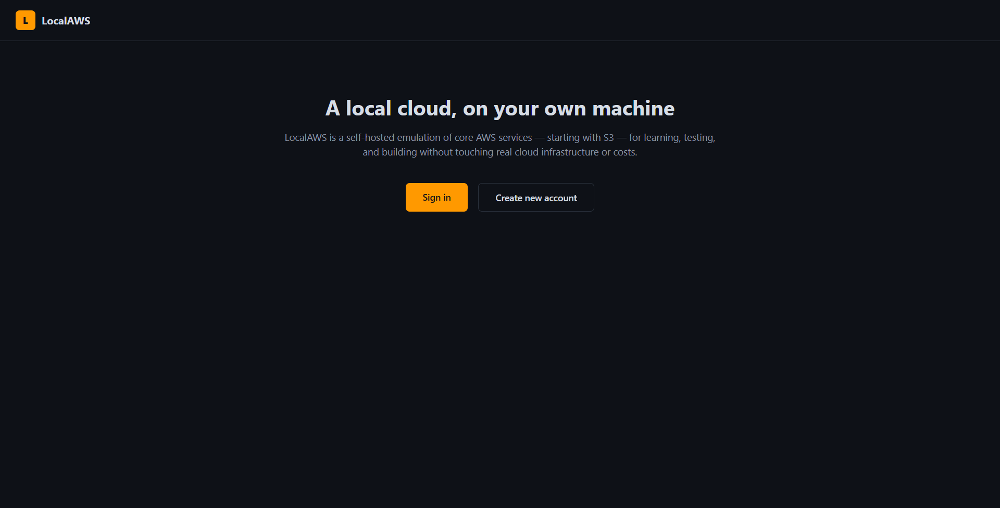
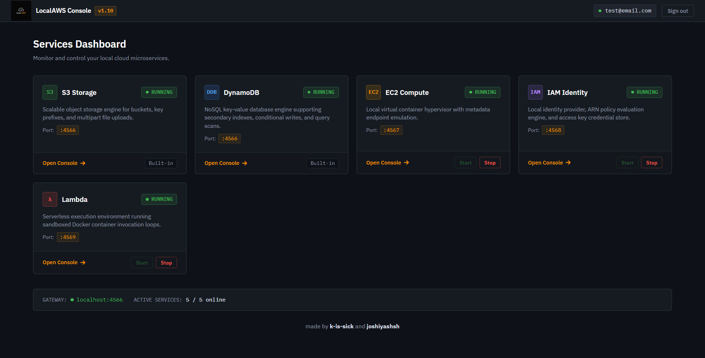
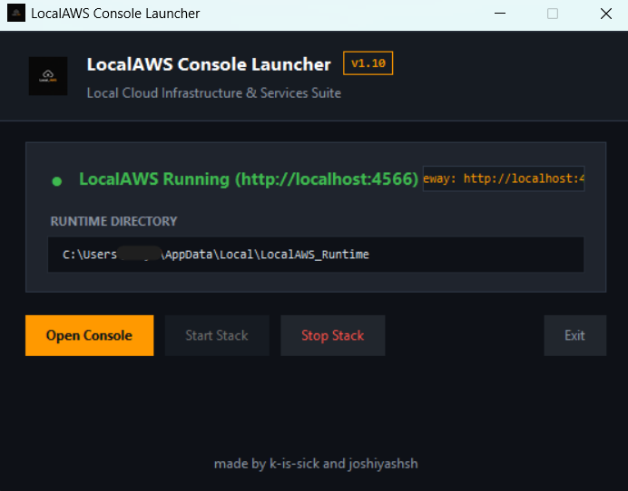
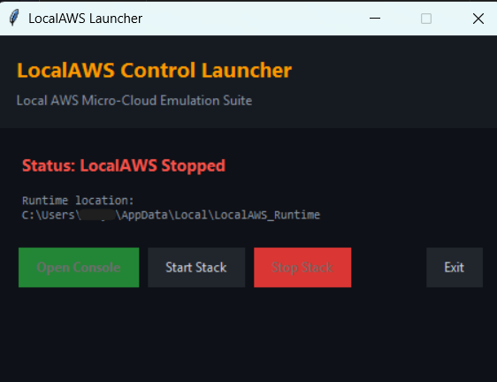

# Local_AWS

A local emulation of core AWS services  S3, DynamoDB, EC2, IAM, and Lambda  built with Flask, PostgreSQL, and Docker. Runs entirely on your own machine, no AWS account required.

## Contents

- [Screenshots](#screenshots)
- [What's included](#whats-included)
- [Running it](#running-it)
- [Using it](#using-it)
- [How it's built](#how-its-built)
- [Ports](#ports)
- [Tech stack](#tech-stack)
- [Author](#author)

## Screenshots









## What's included

- **S3** — buckets and objects: create, upload, download, list, delete.
- **DynamoDB** — tables with partition/sort keys, put/get/delete items, scan.
- **EC2** — instances run as Docker containers, with a browser terminal (`ttyd`) into each one.
- **IAM** — users, access keys, JSON policy documents, ARN-style resource matching. Every service checks permissions against IAM before acting.
- **Lambda** — upload a Python function, invoke it, and it runs inside a short-lived container that's torn down after execution.
- **S3 → Lambda triggers** — attach a Lambda function to a bucket; uploads fire an invoke automatically, without blocking the upload response.
- **Dashboard** — one page (`/services`) shows every service's live status and lets you start/stop each one.
- **Windows launcher** — `LocalAWS.exe` checks for Docker Desktop, brings up the whole stack, and opens the dashboard in your browser. No manual `docker-compose` needed.

## Running it

**Requires:** [Docker Desktop](https://www.docker.com/products/docker-desktop/), running, before either option below.

**Option A — the .exe (Windows):**

Double-click `LocalAWS.exe`. It checks Docker is running, builds and starts everything, and opens `http://localhost:4566`.

**Option B — from source:**

```bash
git clone https://github.com/k-is-sick/Local_AWS.git
cd LocalAWS
docker-compose up -d --build
```

Then open `http://localhost:4566`.

## Using it

1. Sign up / log in at `http://localhost:4566`.
2. From `/services`, open any console — S3, DynamoDB, EC2, IAM, or Lambda.
3. In S3: create a bucket, upload a file.
4. In Lambda: deploy a function (a `handler(event, context)` that returns something), then invoke it and read the logs/output.
5. To wire them together: in the S3 console, set a bucket's notification target to a Lambda function name. Every upload to that bucket after that will invoke the function automatically.
6. From `/services`, stop or start any individual service without touching a terminal.

## How it's built

One Flask app (the gateway) serves the dashboard, S3, and DynamoDB directly, and talks to three separate services over HTTP for EC2, IAM, and Lambda. All four containers share one Docker network. Every write action creating a bucket, launching an instance, invoking a function  goes through IAM's `/api/iam/authorize` first, checked against the caller's access key and the resource's ARN.

## Ports

| Service | Port |
|---|---|
| Gateway / S3 / DynamoDB | 4566 |
| EC2 | 4567 |
| IAM | 4568 |
| Lambda | 4569 |
| PostgreSQL | 5432 |

## Tech stack

Python, Flask, PostgreSQL, Docker + Docker SDK for Python, plain HTML/CSS/JS for the consoles, PyInstaller + Tkinter for the Windows launcher.

## Author

Built by [k-is-sick](https://github.com/k-is-sick) and [joshiyashsh](https://github.com/joshiyashsh)
